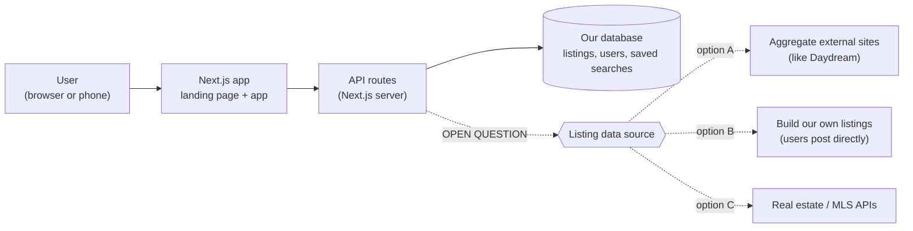

# System overview

First sketch, made before any code exists. Update it as decisions are made.

## What's decided
- One Next.js app serves both the landing page (next week) and the product.

## What's still open
- **Where listing data comes from.** MLS access is the main blocker. Scraping
  needs a legal check before anyone builds it. A few real estate APIs were
  found and still need assessing. The team planned to decide this at the
  Thursday sync.
- Which database and hosting to use. Pick these with the first feature that
  needs stored data.
